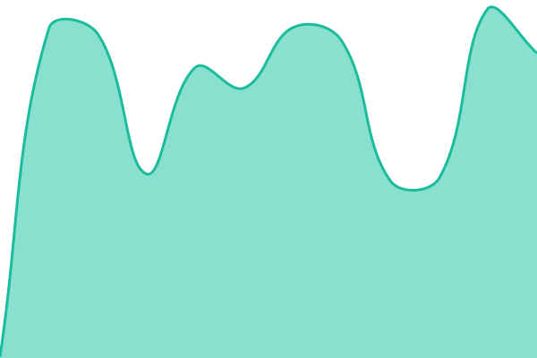
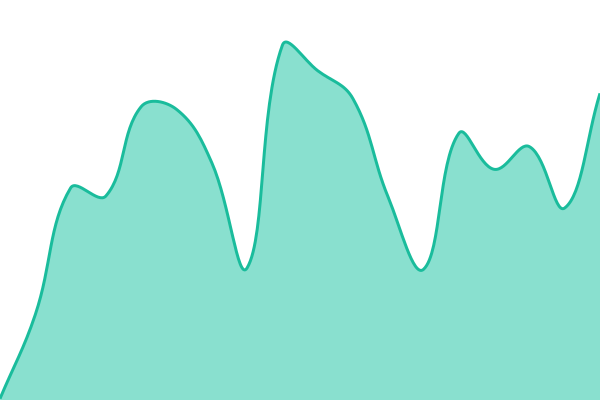
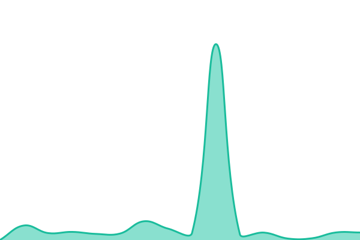
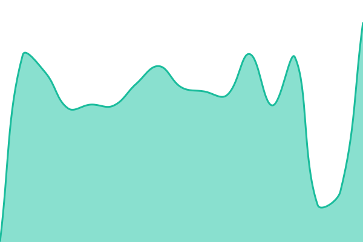
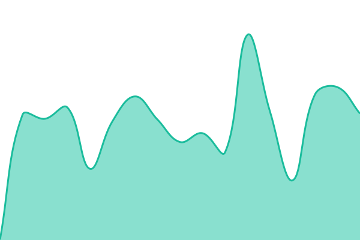

# [📈 Live Status](https://status.sarvabazaar.com): <!--live status--> **🟧 Partial outage**

This repository contains the open-source uptime monitor and status page for [Sarva-organization](https://status.sarvabazaar.com), powered by [Upptime](https://github.com/upptime/upptime).

With [Upptime](https://upptime.js.org), you can get your own unlimited and free uptime monitor and status page, powered entirely by a GitHub repository. We use [Issues](https://github.com/Sarva-organization/sarvabazaar-status/issues) as incident reports, [Actions](https://github.com/Sarva-organization/sarvabazaar-status/actions) as uptime monitors, and [Pages](https://status.sarvabazaar.com) for the status page.

<!--start: status pages-->
<!-- This summary is generated by Upptime (https://github.com/upptime/upptime) -->
<!-- Do not edit this manually, your changes will be overwritten -->
<!-- prettier-ignore -->
| URL | Status | History | Response Time | Uptime |
| --- | ------ | ------- | ------------- | ------ |
|  [Website](https://www.sarvabazaar.com) | 🟩 Up | [website.yml](https://github.com/Sarva-organization/sarvabazaar-status/commits/HEAD/history/website.yml) | 

 607ms
     
 | 

<a href="https://status.sarvabazaar.com/history/website">100.00%</a>
    

|  [Guest Shopping](https://www.sarvabazaar.com/order) | 🟩 Up | [guest-shop.yml](https://github.com/Sarva-organization/sarvabazaar-status/commits/HEAD/history/guest-shop.yml) | 

 461ms
     
 | 

<a href="https://status.sarvabazaar.com/history/guest-shop">100.00%</a>
    

|  [Shop Directory](https://www.sarvabazaar.com/order/vendors) | 🟩 Up | [vendor-listing.yml](https://github.com/Sarva-organization/sarvabazaar-status/commits/HEAD/history/vendor-listing.yml) | 

 301ms
     
 | 

<a href="https://status.sarvabazaar.com/history/vendor-listing">100.00%</a>
    

|  [Order Tracking](https://www.sarvabazaar.com/order-status) | 🟩 Up | [order-status-lookup.yml](https://github.com/Sarva-organization/sarvabazaar-status/commits/HEAD/history/order-status-lookup.yml) | 

 248ms
     
 | 

<a href="https://status.sarvabazaar.com/history/order-status-lookup">100.00%</a>
    

|  [Customer Sign-In](https://www.sarvabazaar.com/customer/auth/signin) | 🟩 Up | [customer-sign-in.yml](https://github.com/Sarva-organization/sarvabazaar-status/commits/HEAD/history/customer-sign-in.yml) | 

 217ms
     
 | 

<a href="https://status.sarvabazaar.com/history/customer-sign-in">100.00%</a>
    

|  [Shop Owner Sign-In](https://www.sarvabazaar.com/vendor/auth/signin) | 🟩 Up | [vendor-sign-in.yml](https://github.com/Sarva-organization/sarvabazaar-status/commits/HEAD/history/vendor-sign-in.yml) | 

 217ms
     
 | 

<a href="https://status.sarvabazaar.com/history/vendor-sign-in">100.00%</a>
    

|  [Driver Sign-In](https://www.sarvabazaar.com/driver/auth/signin) | 🟩 Up | [driver-sign-in.yml](https://github.com/Sarva-organization/sarvabazaar-status/commits/HEAD/history/driver-sign-in.yml) | 

 265ms
     
 | 

<a href="https://status.sarvabazaar.com/history/driver-sign-in">100.00%</a>
    

|  [Customer Registration](https://www.sarvabazaar.com/customer/auth/signup) | 🟩 Up | [customer-signup.yml](https://github.com/Sarva-organization/sarvabazaar-status/commits/HEAD/history/customer-signup.yml) | 

 211ms
     
 | 

<a href="https://status.sarvabazaar.com/history/customer-signup">100.00%</a>
    

|  [Shop Owner Registration](https://www.sarvabazaar.com/vendor/auth/signup) | 🟩 Up | [vendor-signup.yml](https://github.com/Sarva-organization/sarvabazaar-status/commits/HEAD/history/vendor-signup.yml) | 

 225ms
     
 | 

<a href="https://status.sarvabazaar.com/history/vendor-signup">100.00%</a>
    

|  [Driver Registration](https://www.sarvabazaar.com/driver/auth/signup) | 🟩 Up | [driver-signup.yml](https://github.com/Sarva-organization/sarvabazaar-status/commits/HEAD/history/driver-signup.yml) | 

 200ms
     
 | 

<a href="https://status.sarvabazaar.com/history/driver-signup">100.00%</a>
    

|  [Payments](https://www.sarvabazaar.com/api/health/stripe) | 🟩 Up | [payments-stripe.yml](https://github.com/Sarva-organization/sarvabazaar-status/commits/HEAD/history/payments-stripe.yml) | 

 448ms
     
 | 

<a href="https://status.sarvabazaar.com/history/payments-stripe">100.00%</a>
    

|  [Database](https://www.sarvabazaar.com/api/health/firestore) | 🟩 Up | [firestore.yml](https://github.com/Sarva-organization/sarvabazaar-status/commits/HEAD/history/firestore.yml) | 

 823ms
     
 | 

<a href="https://status.sarvabazaar.com/history/firestore">100.00%</a>
    

|  [Account Authentication](https://www.sarvabazaar.com/api/health/firebase-auth) | 🟩 Up | [firebase-auth.yml](https://github.com/Sarva-organization/sarvabazaar-status/commits/HEAD/history/firebase-auth.yml) | 

 342ms
     
 | 

<a href="https://status.sarvabazaar.com/history/firebase-auth">100.00%</a>
    

|  [Abuse Protection](https://www.sarvabazaar.com/api/health/firebase-appcheck) | 🟩 Up | [firebase-app-check.yml](https://github.com/Sarva-organization/sarvabazaar-status/commits/HEAD/history/firebase-app-check.yml) | 

 238ms
     
 | 

<a href="https://status.sarvabazaar.com/history/firebase-app-check">100.00%</a>
    

|  [Media Storage](https://www.sarvabazaar.com/api/health/firebase-storage) | 🟩 Up | [firebase-storage.yml](https://github.com/Sarva-organization/sarvabazaar-status/commits/HEAD/history/firebase-storage.yml) | 

 271ms
     
 | 

<a href="https://status.sarvabazaar.com/history/firebase-storage">100.00%</a>
    

|  [Product Search](https://www.sarvabazaar.com/api/health/algolia) | 🟩 Up | [search-algolia.yml](https://github.com/Sarva-organization/sarvabazaar-status/commits/HEAD/history/search-algolia.yml) | 

 172ms
     
 | 

<a href="https://status.sarvabazaar.com/history/search-algolia">100.00%</a>
    

|  [Voice and AI Assistant](https://www.sarvabazaar.com/api/health/openai) | 🟩 Up | [ai-open-ai.yml](https://github.com/Sarva-organization/sarvabazaar-status/commits/HEAD/history/ai-open-ai.yml) | 

 633ms
     
 | 

<a href="https://status.sarvabazaar.com/history/ai-open-ai">100.00%</a>
    

|  [Maps and Addresses](https://www.sarvabazaar.com/api/health/maps) | 🟩 Up | [maps.yml](https://github.com/Sarva-organization/sarvabazaar-status/commits/HEAD/history/maps.yml) | 

 282ms
     
 | 

<a href="https://status.sarvabazaar.com/history/maps">100.00%</a>
    

|  [Incident Reporting](https://www.sarvabazaar.com/api/health/github) | 🟩 Up | [support-git-hub-api.yml](https://github.com/Sarva-organization/sarvabazaar-status/commits/HEAD/history/support-git-hub-api.yml) | 

 420ms
     
 | 

<a href="https://status.sarvabazaar.com/history/support-git-hub-api">100.00%</a>
    

|  [Email Notifications](https://www.sarvabazaar.com/api/health/email) | 🟩 Up | [email-alerts-config.yml](https://github.com/Sarva-organization/sarvabazaar-status/commits/HEAD/history/email-alerts-config.yml) | 

 141ms
     
 | 

<a href="https://status.sarvabazaar.com/history/email-alerts-config">100.00%</a>
    

|  [Order Pricing](https://www.sarvabazaar.com/api/health/flow-quote) | 🟩 Up | [pricing-flow.yml](https://github.com/Sarva-organization/sarvabazaar-status/commits/HEAD/history/pricing-flow.yml) | 

 137ms
     
 | 

<a href="https://status.sarvabazaar.com/history/pricing-flow">100.00%</a>
    

|  [Checkout](https://www.sarvabazaar.com/api/health/flow-checkout) | 🟩 Up | [checkout-flow.yml](https://github.com/Sarva-organization/sarvabazaar-status/commits/HEAD/history/checkout-flow.yml) | 

 572ms
     
 | 

<a href="https://status.sarvabazaar.com/history/checkout-flow">100.00%</a>
    

|  [Stock Accuracy](https://www.sarvabazaar.com/api/health/flow-checkout-stock) | 🟩 Up | [checkout-stock-flow.yml](https://github.com/Sarva-organization/sarvabazaar-status/commits/HEAD/history/checkout-stock-flow.yml) | 

 445ms
     
 | 

<a href="https://status.sarvabazaar.com/history/checkout-stock-flow">75.63%</a>
    

|  [Search Results](https://www.sarvabazaar.com/api/health/flow-search) | 🟩 Up | [search-flow.yml](https://github.com/Sarva-organization/sarvabazaar-status/commits/HEAD/history/search-flow.yml) | 

 164ms
     
 | 

<a href="https://status.sarvabazaar.com/history/search-flow">100.00%</a>
    

|  [Product Filters and Sorting](https://www.sarvabazaar.com/api/health/shop-search) | 🟩 Up | [shop-search-flow.yml](https://github.com/Sarva-organization/sarvabazaar-status/commits/HEAD/history/shop-search-flow.yml) | 

 270ms
     
 | 

<a href="https://status.sarvabazaar.com/history/shop-search-flow">100.00%</a>
    

|  [Search Relevance](https://www.sarvabazaar.com/api/health/semantic-search) | 🟩 Up | [semantic-search-flow.yml](https://github.com/Sarva-organization/sarvabazaar-status/commits/HEAD/history/semantic-search-flow.yml) | 

 1789ms
     
 | 

<a href="https://status.sarvabazaar.com/history/semantic-search-flow">100.00%</a>
    

|  [Assistant Lookups](https://www.sarvabazaar.com/api/health/assistants) | 🟩 Up | [assistants-flow.yml](https://github.com/Sarva-organization/sarvabazaar-status/commits/HEAD/history/assistants-flow.yml) | 

 195ms
     
 | 

<a href="https://status.sarvabazaar.com/history/assistants-flow">100.00%</a>
    

|  [Order Processing](https://www.sarvabazaar.com/api/health/flow-order) | 🟩 Up | [order-flow.yml](https://github.com/Sarva-organization/sarvabazaar-status/commits/HEAD/history/order-flow.yml) | 

 563ms
     
 | 

<a href="https://status.sarvabazaar.com/history/order-flow">100.00%</a>
    

|  [Order Confirmation](https://www.sarvabazaar.com/api/health/flow-order-confirmation) | 🟩 Up | [order-confirmation-flow.yml](https://github.com/Sarva-organization/sarvabazaar-status/commits/HEAD/history/order-confirmation-flow.yml) | 

 230ms
     
 | 

<a href="https://status.sarvabazaar.com/history/order-confirmation-flow">100.00%</a>
    

|  [Background Jobs](https://www.sarvabazaar.com/api/health/functions) | 🟩 Up | [scheduled-functions.yml](https://github.com/Sarva-organization/sarvabazaar-status/commits/HEAD/history/scheduled-functions.yml) | 

 295ms
     
 | 

<a href="https://status.sarvabazaar.com/history/scheduled-functions">98.65%</a>
    

|  [Abandoned Checkout Cleanup](https://www.sarvabazaar.com/api/health/functions?job=purgeStalePendingOrders) | 🟩 Up | [purge-pending-orders.yml](https://github.com/Sarva-organization/sarvabazaar-status/commits/HEAD/history/purge-pending-orders.yml) | 

 163ms
     
 | 

<a href="https://status.sarvabazaar.com/history/purge-pending-orders">100.00%</a>
    

|  [Payout Retries](https://www.sarvabazaar.com/api/health/functions?job=reconcileFailedTransfers) | 🟩 Up | [reconcile-failed-transfers.yml](https://github.com/Sarva-organization/sarvabazaar-status/commits/HEAD/history/reconcile-failed-transfers.yml) | 

 184ms
     
 | 

<a href="https://status.sarvabazaar.com/history/reconcile-failed-transfers">100.00%</a>
    

|  [Document Expiry Reminders](https://www.sarvabazaar.com/api/health/functions?job=driverExpiryReminders) | 🟩 Up | [driver-expiry-reminders.yml](https://github.com/Sarva-organization/sarvabazaar-status/commits/HEAD/history/driver-expiry-reminders.yml) | 

 233ms
     
 | 

<a href="https://status.sarvabazaar.com/history/driver-expiry-reminders">97.61%</a>
    

|  [Driver Document Retention](https://www.sarvabazaar.com/api/health/functions?job=purgeDriverComplianceData) | 🟩 Up | [purge-driver-compliance.yml](https://github.com/Sarva-organization/sarvabazaar-status/commits/HEAD/history/purge-driver-compliance.yml) | 

 210ms
     
 | 

<a href="https://status.sarvabazaar.com/history/purge-driver-compliance">97.63%</a>
    

|  [Data Consistency](https://www.sarvabazaar.com/api/health/triggers) | 🟩 Up | [trigger-functions.yml](https://github.com/Sarva-organization/sarvabazaar-status/commits/HEAD/history/trigger-functions.yml) | 

 689ms
     
 | 

<a href="https://status.sarvabazaar.com/history/trigger-functions">99.68%</a>
    

|  [Order Tracking Sync](https://www.sarvabazaar.com/api/health/triggers?check=order-mirror) | 🟩 Up | [order-mirror.yml](https://github.com/Sarva-organization/sarvabazaar-status/commits/HEAD/history/order-mirror.yml) | 

 222ms
     
 | 

<a href="https://status.sarvabazaar.com/history/order-mirror">99.69%</a>
    

|  [Payment Updates](https://www.sarvabazaar.com/api/health/flow-webhooks) | 🟩 Up | [webhooks-flow.yml](https://github.com/Sarva-organization/sarvabazaar-status/commits/HEAD/history/webhooks-flow.yml) | 

 400ms
     
 | 

<a href="https://status.sarvabazaar.com/history/webhooks-flow">100.00%</a>
    

|  [Shop and Driver Payouts](https://www.sarvabazaar.com/api/health/flow-payouts) | 🟩 Up | [payouts-flow.yml](https://github.com/Sarva-organization/sarvabazaar-status/commits/HEAD/history/payouts-flow.yml) | 

 263ms
     
 | 

<a href="https://status.sarvabazaar.com/history/payouts-flow">100.00%</a>
    

|  [Payouts Page](https://www.sarvabazaar.com/api/health/flow-payouts-page) | 🟩 Up | [payouts-page-flow.yml](https://github.com/Sarva-organization/sarvabazaar-status/commits/HEAD/history/payouts-page-flow.yml) | 

 282ms
     
 | 

<a href="https://status.sarvabazaar.com/history/payouts-page-flow">97.74%</a>
    

|  [Payout History Auth Gate](https://www.sarvabazaar.com/api/payouts/orders) | 🟩 Up | [payouts-orders-auth.yml](https://github.com/Sarva-organization/sarvabazaar-status/commits/HEAD/history/payouts-orders-auth.yml) | 

 142ms
     
 | 

<a href="https://status.sarvabazaar.com/history/payouts-orders-auth">100.00%</a>
    

|  [Payout Session Auth Gate](https://www.sarvabazaar.com/api/payouts/session) | 🟩 Up | [payouts-session-auth.yml](https://github.com/Sarva-organization/sarvabazaar-status/commits/HEAD/history/payouts-session-auth.yml) | 

 131ms
     
 | 

<a href="https://status.sarvabazaar.com/history/payouts-session-auth">100.00%</a>
    

|  [Shop Owner Dashboard](https://www.sarvabazaar.com/api/health/flow-vendor-metrics) | 🟩 Up | [vendor-metrics-flow.yml](https://github.com/Sarva-organization/sarvabazaar-status/commits/HEAD/history/vendor-metrics-flow.yml) | 

 228ms
     
 | 

<a href="https://status.sarvabazaar.com/history/vendor-metrics-flow">100.00%</a>
    

|  [Driver Dashboard](https://www.sarvabazaar.com/api/health/flow-driver-metrics) | 🟩 Up | [driver-metrics-flow.yml](https://github.com/Sarva-organization/sarvabazaar-status/commits/HEAD/history/driver-metrics-flow.yml) | 

 225ms
     
 | 

<a href="https://status.sarvabazaar.com/history/driver-metrics-flow">100.00%</a>
    

|  [Driver Report](https://www.sarvabazaar.com/api/health/flow-driver-report) | 🟩 Up | [driver-report-flow.yml](https://github.com/Sarva-organization/sarvabazaar-status/commits/HEAD/history/driver-report-flow.yml) | 

 183ms
     
 | 

<a href="https://status.sarvabazaar.com/history/driver-report-flow">99.24%</a>
    

|  [Driver Compliance](https://www.sarvabazaar.com/api/health/flow-driver-compliance) | 🟥 Down | [driver-compliance-flow.yml](https://github.com/Sarva-organization/sarvabazaar-status/commits/HEAD/history/driver-compliance-flow.yml) | 

 166ms
     
 | 

<a href="https://status.sarvabazaar.com/history/driver-compliance-flow">37.63%</a>
    

|  [Driver Deliveries and Search](https://www.sarvabazaar.com/api/health/flow-driver-orders) | 🟩 Up | [driver-orders-flow.yml](https://github.com/Sarva-organization/sarvabazaar-status/commits/HEAD/history/driver-orders-flow.yml) | 

 1075ms
     
 | 

<a href="https://status.sarvabazaar.com/history/driver-orders-flow">100.00%</a>
    

|  [Customer Dashboard](https://www.sarvabazaar.com/api/health/flow-customer-metrics) | 🟩 Up | [customer-metrics-flow.yml](https://github.com/Sarva-organization/sarvabazaar-status/commits/HEAD/history/customer-metrics-flow.yml) | 

 197ms
     
 | 

<a href="https://status.sarvabazaar.com/history/customer-metrics-flow">100.00%</a>
    

|  [Order History and Search](https://www.sarvabazaar.com/api/health/flow-customer-orders) | 🟩 Up | [customer-orders-flow.yml](https://github.com/Sarva-organization/sarvabazaar-status/commits/HEAD/history/customer-orders-flow.yml) | 

 587ms
     
 | 

<a href="https://status.sarvabazaar.com/history/customer-orders-flow">100.00%</a>
    

|  [Customer Profile](https://www.sarvabazaar.com/api/health/flow-customer-profile) | 🟩 Up | [customer-profile-flow.yml](https://github.com/Sarva-organization/sarvabazaar-status/commits/HEAD/history/customer-profile-flow.yml) | 

 254ms
     
 | 

<a href="https://status.sarvabazaar.com/history/customer-profile-flow">99.40%</a>
    

|  [Guest Order Lookup](https://www.sarvabazaar.com/api/health/flow-guest-order-lookup) | 🟩 Up | [guest-order-lookup-flow.yml](https://github.com/Sarva-organization/sarvabazaar-status/commits/HEAD/history/guest-order-lookup-flow.yml) | 

 439ms
     
 | 

<a href="https://status.sarvabazaar.com/history/guest-order-lookup-flow">100.00%</a>
    

|  [Vercel](https://www.vercel-status.com/api/v2/status.json) | 🟩 Up | [upstream-vercel-status.yml](https://github.com/Sarva-organization/sarvabazaar-status/commits/HEAD/history/upstream-vercel-status.yml) | 

 163ms
     
 | 

<a href="https://status.sarvabazaar.com/history/upstream-vercel-status">99.32%</a>
    

|  [OpenAI](https://status.openai.com/api/v2/status.json) | 🟥 Down | [upstream-open-ai-status.yml](https://github.com/Sarva-organization/sarvabazaar-status/commits/HEAD/history/upstream-open-ai-status.yml) | 

 223ms
     
 | 

<a href="https://status.sarvabazaar.com/history/upstream-open-ai-status">91.75%</a>
    

|  [GitHub](https://www.githubstatus.com/api/v2/status.json) | 🟩 Up | [upstream-git-hub-status.yml](https://github.com/Sarva-organization/sarvabazaar-status/commits/HEAD/history/upstream-git-hub-status.yml) | 

 97ms
     
 | 

<a href="https://status.sarvabazaar.com/history/upstream-git-hub-status">92.53%</a>
    

|  [EmailJS](https://status.emailjs.com/index.json) | 🟩 Up | [upstream-email-js-status.yml](https://github.com/Sarva-organization/sarvabazaar-status/commits/HEAD/history/upstream-email-js-status.yml) | 

 745ms
     
 | 

<a href="https://status.sarvabazaar.com/history/upstream-email-js-status">100.00%</a>
    

|  [Stripe](https://status.stripe.com/) | 🟩 Up | [upstream-stripe-status-page-only.yml](https://github.com/Sarva-organization/sarvabazaar-status/commits/HEAD/history/upstream-stripe-status-page-only.yml) | 

 99ms
     
 | 

<a href="https://status.sarvabazaar.com/history/upstream-stripe-status-page-only">100.00%</a>
    

|  [Algolia](https://status.algolia.com/) | 🟩 Up | [upstream-algolia-status-page-only.yml](https://github.com/Sarva-organization/sarvabazaar-status/commits/HEAD/history/upstream-algolia-status-page-only.yml) | 

 108ms
     
 | 

<a href="https://status.sarvabazaar.com/history/upstream-algolia-status-page-only">100.00%</a>
    

<!--end: status pages-->

[**Visit our status website →**](https://status.sarvabazaar.com)

## 📄 License

- Powered by: [Upptime](https://github.com/upptime/upptime)
- Code: [MIT](./LICENSE) © [Anand Chowdhary](https://anandchowdhary.com)
- Data in the `./history` directory: [Open Database License](https://opendatacommons.org/licenses/odbl/1-0/)
