# [📈 Live Status](https://status.sarvabazaar.com): <!--live status--> **🟩 All systems operational**

This repository contains the open-source uptime monitor and status page for [Sarva-organization](https://status.sarvabazaar.com), powered by [Upptime](https://github.com/upptime/upptime).

With [Upptime](https://upptime.js.org), you can get your own unlimited and free uptime monitor and status page, powered entirely by a GitHub repository. We use [Issues](https://github.com/Sarva-organization/sarvabazaar-status/issues) as incident reports, [Actions](https://github.com/Sarva-organization/sarvabazaar-status/actions) as uptime monitors, and [Pages](https://status.sarvabazaar.com) for the status page.

<!--start: status pages-->
<!-- This summary is generated by Upptime (https://github.com/upptime/upptime) -->
<!-- Do not edit this manually, your changes will be overwritten -->
<!-- prettier-ignore -->
| URL | Status | History | Response Time | Uptime |
| --- | ------ | ------- | ------------- | ------ |
|  [Website](https://www.sarvabazaar.com) | 🟩 Up | [website.yml](https://github.com/Sarva-organization/sarvabazaar-status/commits/HEAD/history/website.yml) | 

 526ms
     
 | 

<a href="https://status.sarvabazaar.com/history/website">100.00%</a>
    

|  [Guest Shopping](https://www.sarvabazaar.com/order) | 🟩 Up | [guest-shop.yml](https://github.com/Sarva-organization/sarvabazaar-status/commits/HEAD/history/guest-shop.yml) | 

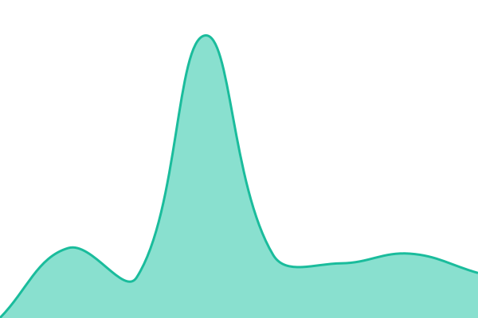 1181ms
     
 | 

<a href="https://status.sarvabazaar.com/history/guest-shop">100.00%</a>
    

|  [Shop Directory](https://www.sarvabazaar.com/order/vendors) | 🟩 Up | [vendor-listing.yml](https://github.com/Sarva-organization/sarvabazaar-status/commits/HEAD/history/vendor-listing.yml) | 

 254ms
     
 | 

<a href="https://status.sarvabazaar.com/history/vendor-listing">100.00%</a>
    

|  [Order Tracking](https://www.sarvabazaar.com/order-status) | 🟩 Up | [order-status-lookup.yml](https://github.com/Sarva-organization/sarvabazaar-status/commits/HEAD/history/order-status-lookup.yml) | 

 128ms
     
 | 

<a href="https://status.sarvabazaar.com/history/order-status-lookup">100.00%</a>
    

|  [Customer Sign-In](https://www.sarvabazaar.com/customer/auth/signin) | 🟩 Up | [customer-sign-in.yml](https://github.com/Sarva-organization/sarvabazaar-status/commits/HEAD/history/customer-sign-in.yml) | 

 139ms
     
 | 

<a href="https://status.sarvabazaar.com/history/customer-sign-in">100.00%</a>
    

|  [Shop Owner Sign-In](https://www.sarvabazaar.com/vendor/auth/signin) | 🟩 Up | [vendor-sign-in.yml](https://github.com/Sarva-organization/sarvabazaar-status/commits/HEAD/history/vendor-sign-in.yml) | 

 136ms
     
 | 

<a href="https://status.sarvabazaar.com/history/vendor-sign-in">100.00%</a>
    

|  [Driver Sign-In](https://www.sarvabazaar.com/driver/auth/signin) | 🟩 Up | [driver-sign-in.yml](https://github.com/Sarva-organization/sarvabazaar-status/commits/HEAD/history/driver-sign-in.yml) | 

 173ms
     
 | 

<a href="https://status.sarvabazaar.com/history/driver-sign-in">100.00%</a>
    

|  [Customer Registration](https://www.sarvabazaar.com/customer/auth/signup) | 🟩 Up | [customer-signup.yml](https://github.com/Sarva-organization/sarvabazaar-status/commits/HEAD/history/customer-signup.yml) | 

 136ms
     
 | 

<a href="https://status.sarvabazaar.com/history/customer-signup">100.00%</a>
    

|  [Shop Owner Registration](https://www.sarvabazaar.com/vendor/auth/signup) | 🟩 Up | [vendor-signup.yml](https://github.com/Sarva-organization/sarvabazaar-status/commits/HEAD/history/vendor-signup.yml) | 

 136ms
     
 | 

<a href="https://status.sarvabazaar.com/history/vendor-signup">100.00%</a>
    

|  [Driver Registration](https://www.sarvabazaar.com/driver/auth/signup) | 🟩 Up | [driver-signup.yml](https://github.com/Sarva-organization/sarvabazaar-status/commits/HEAD/history/driver-signup.yml) | 

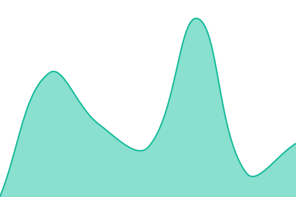 154ms
     
 | 

<a href="https://status.sarvabazaar.com/history/driver-signup">100.00%</a>
    

|  [Payments](https://www.sarvabazaar.com/api/health/stripe) | 🟩 Up | [payments-stripe.yml](https://github.com/Sarva-organization/sarvabazaar-status/commits/HEAD/history/payments-stripe.yml) | 

 386ms
     
 | 

<a href="https://status.sarvabazaar.com/history/payments-stripe">100.00%</a>
    

|  [Database](https://www.sarvabazaar.com/api/health/firestore) | 🟩 Up | [firestore.yml](https://github.com/Sarva-organization/sarvabazaar-status/commits/HEAD/history/firestore.yml) | 

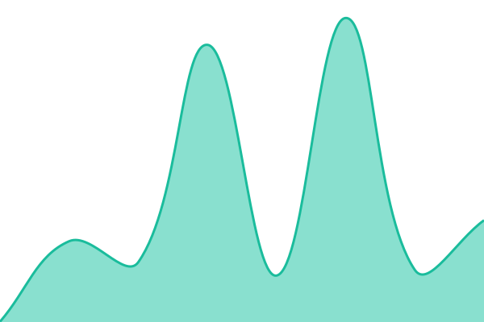 591ms
     
 | 

<a href="https://status.sarvabazaar.com/history/firestore">100.00%</a>
    

|  [Account Authentication](https://www.sarvabazaar.com/api/health/firebase-auth) | 🟩 Up | [firebase-auth.yml](https://github.com/Sarva-organization/sarvabazaar-status/commits/HEAD/history/firebase-auth.yml) | 

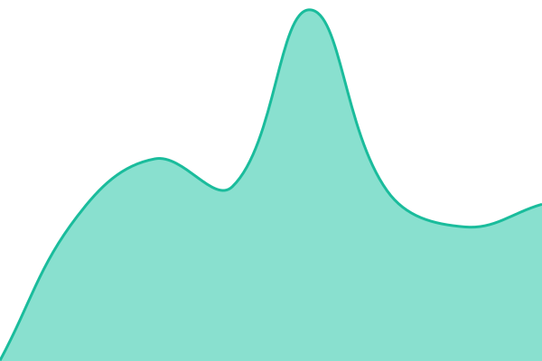 335ms
     
 | 

<a href="https://status.sarvabazaar.com/history/firebase-auth">100.00%</a>
    

|  [Abuse Protection](https://www.sarvabazaar.com/api/health/firebase-appcheck) | 🟩 Up | [firebase-app-check.yml](https://github.com/Sarva-organization/sarvabazaar-status/commits/HEAD/history/firebase-app-check.yml) | 

 211ms
     
 | 

<a href="https://status.sarvabazaar.com/history/firebase-app-check">100.00%</a>
    

|  [Media Storage](https://www.sarvabazaar.com/api/health/firebase-storage) | 🟩 Up | [firebase-storage.yml](https://github.com/Sarva-organization/sarvabazaar-status/commits/HEAD/history/firebase-storage.yml) | 

 205ms
     
 | 

<a href="https://status.sarvabazaar.com/history/firebase-storage">100.00%</a>
    

|  [Voice and AI Assistant](https://www.sarvabazaar.com/api/health/openai) | 🟩 Up | [ai-open-ai.yml](https://github.com/Sarva-organization/sarvabazaar-status/commits/HEAD/history/ai-open-ai.yml) | 

 906ms
     
 | 

<a href="https://status.sarvabazaar.com/history/ai-open-ai">100.00%</a>
    

|  [Incident Reporting](https://www.sarvabazaar.com/api/health/github) | 🟩 Up | [support-git-hub-api.yml](https://github.com/Sarva-organization/sarvabazaar-status/commits/HEAD/history/support-git-hub-api.yml) | 

 430ms
     
 | 

<a href="https://status.sarvabazaar.com/history/support-git-hub-api">100.00%</a>
    

|  [Shop Search (live traffic)](https://www.sarvabazaar.com/api/health/traffic?signal=shop-search) | 🟩 Up | [traffic-shop-search.yml](https://github.com/Sarva-organization/sarvabazaar-status/commits/HEAD/history/traffic-shop-search.yml) | 

 285ms
     
 | 

<a href="https://status.sarvabazaar.com/history/traffic-shop-search">100.00%</a>
    

|  [Support Requests (live traffic)](https://www.sarvabazaar.com/api/health/traffic?signal=support-ticket) | 🟩 Up | [traffic-support-ticket.yml](https://github.com/Sarva-organization/sarvabazaar-status/commits/HEAD/history/traffic-support-ticket.yml) | 

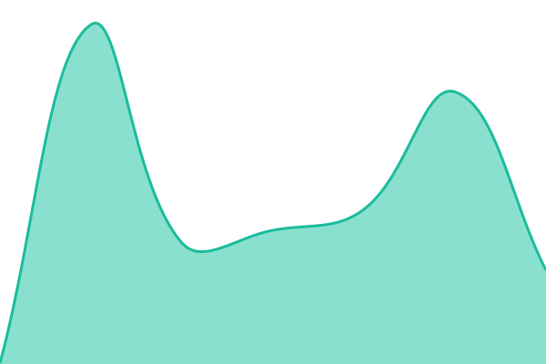 143ms
     
 | 

<a href="https://status.sarvabazaar.com/history/traffic-support-ticket">100.00%</a>
    

|  [Background Jobs](https://www.sarvabazaar.com/api/health/functions) | 🟩 Up | [scheduled-functions.yml](https://github.com/Sarva-organization/sarvabazaar-status/commits/HEAD/history/scheduled-functions.yml) | 

 267ms
     
 | 

<a href="https://status.sarvabazaar.com/history/scheduled-functions">86.81%</a>
    

|  [Abandoned Checkout Cleanup](https://www.sarvabazaar.com/api/health/functions?job=purgeStalePendingOrders) | 🟩 Up | [purge-pending-orders.yml](https://github.com/Sarva-organization/sarvabazaar-status/commits/HEAD/history/purge-pending-orders.yml) | 

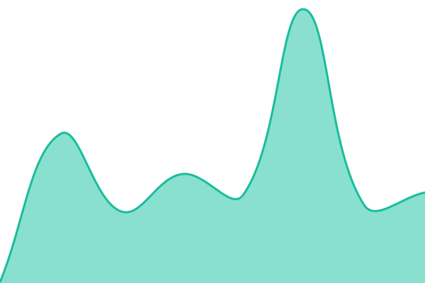 316ms
     
 | 

<a href="https://status.sarvabazaar.com/history/purge-pending-orders">100.00%</a>
    

|  [Payout Retries](https://www.sarvabazaar.com/api/health/functions?job=reconcileFailedTransfers) | 🟩 Up | [reconcile-failed-transfers.yml](https://github.com/Sarva-organization/sarvabazaar-status/commits/HEAD/history/reconcile-failed-transfers.yml) | 

 244ms
     
 | 

<a href="https://status.sarvabazaar.com/history/reconcile-failed-transfers">86.81%</a>
    

|  [Document Expiry Reminders](https://www.sarvabazaar.com/api/health/functions?job=driverExpiryReminders) | 🟩 Up | [driver-expiry-reminders.yml](https://github.com/Sarva-organization/sarvabazaar-status/commits/HEAD/history/driver-expiry-reminders.yml) | 

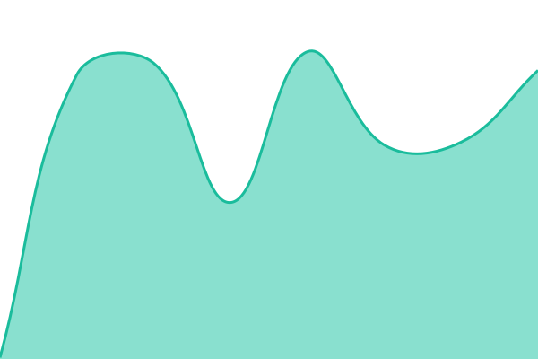 162ms
     
 | 

<a href="https://status.sarvabazaar.com/history/driver-expiry-reminders">97.32%</a>
    

|  [Driver Document Retention](https://www.sarvabazaar.com/api/health/functions?job=purgeDriverComplianceData) | 🟩 Up | [purge-driver-compliance.yml](https://github.com/Sarva-organization/sarvabazaar-status/commits/HEAD/history/purge-driver-compliance.yml) | 

 165ms
     
 | 

<a href="https://status.sarvabazaar.com/history/purge-driver-compliance">100.00%</a>
    

|  [Data Consistency](https://www.sarvabazaar.com/api/health/triggers) | 🟩 Up | [trigger-functions.yml](https://github.com/Sarva-organization/sarvabazaar-status/commits/HEAD/history/trigger-functions.yml) | 

 615ms
     
 | 

<a href="https://status.sarvabazaar.com/history/trigger-functions">100.00%</a>
    

|  [Order Tracking Sync](https://www.sarvabazaar.com/api/health/triggers?check=order-mirror) | 🟩 Up | [order-mirror.yml](https://github.com/Sarva-organization/sarvabazaar-status/commits/HEAD/history/order-mirror.yml) | 

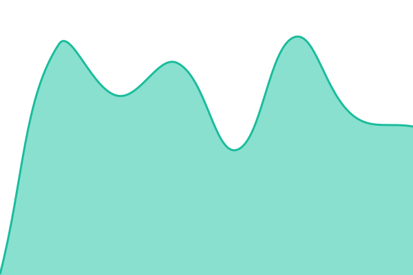 219ms
     
 | 

<a href="https://status.sarvabazaar.com/history/order-mirror">100.00%</a>
    

|  [Payout History Protection](https://www.sarvabazaar.com/api/payouts/orders) | 🟩 Up | [payouts-orders-auth.yml](https://github.com/Sarva-organization/sarvabazaar-status/commits/HEAD/history/payouts-orders-auth.yml) | 

 255ms
     
 | 

<a href="https://status.sarvabazaar.com/history/payouts-orders-auth">100.00%</a>
    

|  [Payout Setup Protection](https://www.sarvabazaar.com/api/payouts/session) | 🟩 Up | [payouts-session-auth.yml](https://github.com/Sarva-organization/sarvabazaar-status/commits/HEAD/history/payouts-session-auth.yml) | 

 230ms
     
 | 

<a href="https://status.sarvabazaar.com/history/payouts-session-auth">100.00%</a>
    

|  [OpenAI Chat](https://status.openai.com/api/v2/components.json) | 🟩 Up | [upstream-open-ai-status.yml](https://github.com/Sarva-organization/sarvabazaar-status/commits/HEAD/history/upstream-open-ai-status.yml) | 

 296ms
     
 | 

<a href="https://status.sarvabazaar.com/history/upstream-open-ai-status">100.00%</a>
    

|  [OpenAI Voice](https://status.openai.com/api/v2/components.json) | 🟩 Up | [upstream-open-ai-realtime.yml](https://github.com/Sarva-organization/sarvabazaar-status/commits/HEAD/history/upstream-open-ai-realtime.yml) | 

 260ms
     
 | 

<a href="https://status.sarvabazaar.com/history/upstream-open-ai-realtime">100.00%</a>
    

|  [OpenAI Embeddings](https://status.openai.com/api/v2/components.json) | 🟩 Up | [upstream-open-ai-embeddings.yml](https://github.com/Sarva-organization/sarvabazaar-status/commits/HEAD/history/upstream-open-ai-embeddings.yml) | 

 265ms
     
 | 

<a href="https://status.sarvabazaar.com/history/upstream-open-ai-embeddings">100.00%</a>
    

|  [OpenAI Speech](https://status.openai.com/api/v2/components.json) | 🟩 Up | [upstream-open-ai-audio.yml](https://github.com/Sarva-organization/sarvabazaar-status/commits/HEAD/history/upstream-open-ai-audio.yml) | 

 223ms
     
 | 

<a href="https://status.sarvabazaar.com/history/upstream-open-ai-audio">100.00%</a>
    

|  [Vercel Functions](https://www.vercel-status.com/api/v2/components.json) | 🟩 Up | [upstream-vercel-status.yml](https://github.com/Sarva-organization/sarvabazaar-status/commits/HEAD/history/upstream-vercel-status.yml) | 

 239ms
     
 | 

<a href="https://status.sarvabazaar.com/history/upstream-vercel-status">99.49%</a>
    

|  [Vercel Data Cache](https://www.vercel-status.com/api/v2/components.json) | 🟩 Up | [upstream-vercel-data-cache.yml](https://github.com/Sarva-organization/sarvabazaar-status/commits/HEAD/history/upstream-vercel-data-cache.yml) | 

 59ms
     
 | 

<a href="https://status.sarvabazaar.com/history/upstream-vercel-data-cache">100.00%</a>
    

|  [Vercel Image Optimization](https://www.vercel-status.com/api/v2/components.json) | 🟩 Up | [upstream-vercel-image-optimization.yml](https://github.com/Sarva-organization/sarvabazaar-status/commits/HEAD/history/upstream-vercel-image-optimization.yml) | 

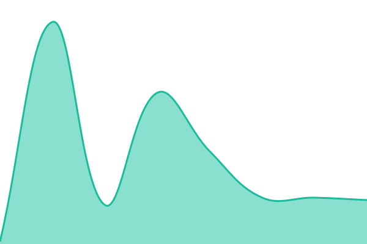 50ms
     
 | 

<a href="https://status.sarvabazaar.com/history/upstream-vercel-image-optimization">100.00%</a>
    

|  [Status Page Monitor](https://www.githubstatus.com/api/v2/components.json) | 🟩 Up | [upstream-git-hub-status.yml](https://github.com/Sarva-organization/sarvabazaar-status/commits/HEAD/history/upstream-git-hub-status.yml) | 

 80ms
     
 | 

<a href="https://status.sarvabazaar.com/history/upstream-git-hub-status">99.50%</a>
    

|  [Status Page Reporting](https://www.githubstatus.com/api/v2/components.json) | 🟩 Up | [upstream-git-hub-api.yml](https://github.com/Sarva-organization/sarvabazaar-status/commits/HEAD/history/upstream-git-hub-api.yml) | 

 36ms
     
 | 

<a href="https://status.sarvabazaar.com/history/upstream-git-hub-api">100.00%</a>
    

|  [Status Page Hosting](https://www.githubstatus.com/api/v2/components.json) | 🟩 Up | [upstream-git-hub-pages.yml](https://github.com/Sarva-organization/sarvabazaar-status/commits/HEAD/history/upstream-git-hub-pages.yml) | 

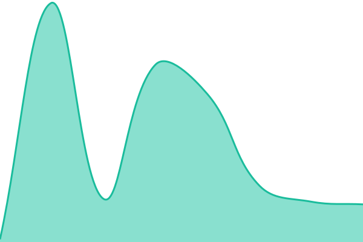 47ms
     
 | 

<a href="https://status.sarvabazaar.com/history/upstream-git-hub-pages">100.00%</a>
    

|  [Firebase Platform](https://www.sarvabazaar.com/api/health/vendor-status?vendor=firebase&strict=1) | 🟩 Up | [upstream-firebase-status.yml](https://github.com/Sarva-organization/sarvabazaar-status/commits/HEAD/history/upstream-firebase-status.yml) | 

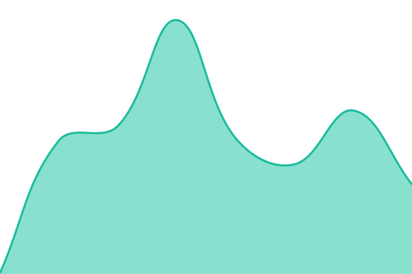 159ms
     
 | 

<a href="https://status.sarvabazaar.com/history/upstream-firebase-status">100.00%</a>
    

|  [Google Maps Platform](https://www.sarvabazaar.com/api/health/vendor-status?vendor=maps&strict=1) | 🟩 Up | [upstream-google-maps-status.yml](https://github.com/Sarva-organization/sarvabazaar-status/commits/HEAD/history/upstream-google-maps-status.yml) | 

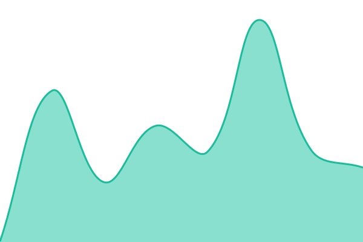 153ms
     
 | 

<a href="https://status.sarvabazaar.com/history/upstream-google-maps-status">100.00%</a>
    

|  [Algolia Search Cluster](https://status.algolia.com/1/status) | 🟩 Up | [upstream-algolia-status-page-only.yml](https://github.com/Sarva-organization/sarvabazaar-status/commits/HEAD/history/upstream-algolia-status-page-only.yml) | 

 131ms
     
 | 

<a href="https://status.sarvabazaar.com/history/upstream-algolia-status-page-only">100.00%</a>
    

|  [EmailJS](https://status.emailjs.com/index.json) | 🟩 Up | [upstream-email-js-status.yml](https://github.com/Sarva-organization/sarvabazaar-status/commits/HEAD/history/upstream-email-js-status.yml) | 

 689ms
     
 | 

<a href="https://status.sarvabazaar.com/history/upstream-email-js-status">100.00%</a>
    

|  [Stripe](https://status.stripe.com/) | 🟩 Up | [upstream-stripe-status-page-only.yml](https://github.com/Sarva-organization/sarvabazaar-status/commits/HEAD/history/upstream-stripe-status-page-only.yml) | 

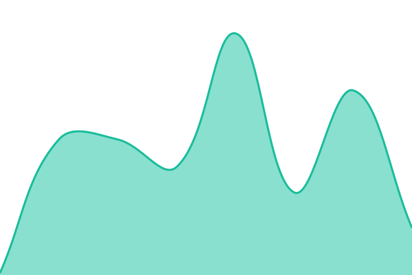 83ms
     
 | 

<a href="https://status.sarvabazaar.com/history/upstream-stripe-status-page-only">100.00%</a>
    

<!--end: status pages-->

[**Visit our status website →**](https://status.sarvabazaar.com)

## 📄 License

- Powered by: [Upptime](https://github.com/upptime/upptime)
- Code: [MIT](./LICENSE) © [Anand Chowdhary](https://anandchowdhary.com)
- Data in the `./history` directory: [Open Database License](https://opendatacommons.org/licenses/odbl/1-0/)
